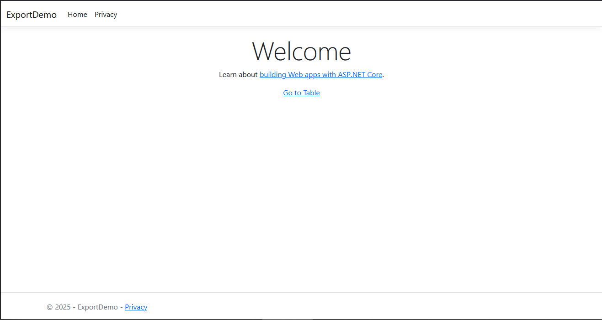
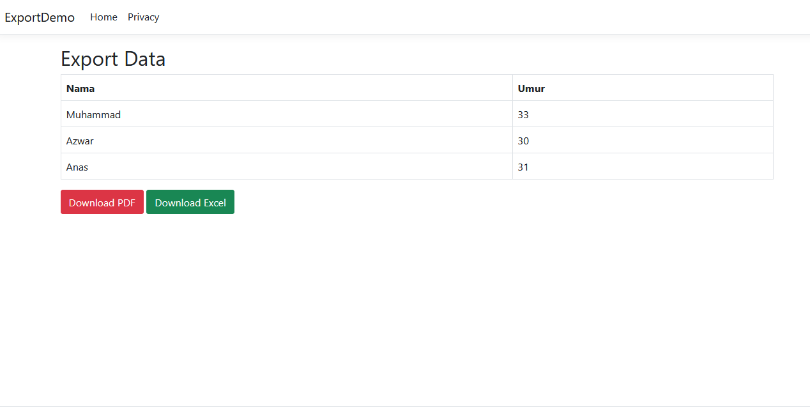

# ASP.NET Core Export Excel & PDF (Technical Test - AigisLabs)

A simple ASP.NET Core MVC application to demonstrate **exporting data to Excel and PDF**, as required in the technical test for **Junior .NET Developer at AigisLabs**.

---

## 🚀 Features

- Export table data to **PDF** using [Rotativa.AspNetCore](https://github.com/webjay/Rotativa.AspNetCore)
- Export table data to **Excel (.xlsx)** using [ClosedXML](https://github.com/ClosedXML/ClosedXML)
- Uses **dummy data** without database
- Clean MVC structure
- Compatible with .NET 6 / 7 / 8

---

## 📸 Screenshots

| Main Page | Export Result |
|-----------|---------------|
|  |  |

_(optional, upload screenshots to folder `screenshots/`)_

---

## 📦 Requirements

- .NET 6 SDK or newer
- wkhtmltopdf (included in `wwwroot/Rotativa`)
- Visual Studio or VS Code

---

## 🔧 How to Run

1. Clone repo:
   ```bash
   git clone https://github.com/tkarombang/aspnet-export-excel-pdfgit
